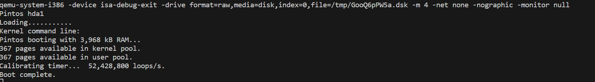

# Project 0: Getting Real

## Preliminaries

>Fill in your name and email address.

FirstName LastName <email@domain.example>

>If you have any preliminary comments on your submission, notes for the TAs, please give them here.

>Please cite any offline or online sources you consulted while preparing your submission, other than the Pintos documentation, course text, lecture notes, and course staff.

## Booting Pintos

>A1: Put the screenshot of Pintos running example here.

## Debugging

#### QUESTIONS: BIOS 

>B1: What is the first instruction that gets executed?

ljmp   $0x3630,$0xf000e05b

>B2: At which physical address is this instruction located?

0xfff0

#### QUESTIONS: BOOTLOADER

>B3: How does the bootloader read disk sectors? In particular, what BIOS interrupt is used?

将磁盘扇区读入到起始地址为ES:0000的内存中，通过调用编号为19的BIOS中断完成，如果出错的话错误码会保存在CF标志位中。

number 19 BIOS

>B4: How does the bootloader decides whether it successfully finds the Pintos kernel?
将某个字节与 0x75进行对比是否相等，如果不相等，则去对比下一个partition

>B5: What happens when the bootloader could not find the Pintos kernel?
当前partition 没找到，找下一个partition，当前driver没找到，找下一个dirver，如果都找不到就放弃，通过BIOS中断发送无法找到pintos kernel的通知。

>B6: At what point and how exactly does the bootloader transfer control to the Pintos kernel?
通过0x74对比找到bootable partition，然后后将下一个指令的地址设置为0x20000

#### QUESTIONS: KERNEL

>B7: At the entry of pintos_init(), what is the value of expression `init_page_dir[pd_no(ptov(0))]` in hexadecimal format?

0

>B8: When `palloc_get_page()` is called for the first time,

>> B8.1 what does the call stack look like?
>>
>>
#0  palloc_get_page (flags=(PAL_ASSERT | PAL_ZERO)) at ../../threads/palloc.c:112
#1  0xc00203aa in paging_init () at ../../threads/init.c:168
#2  0xc002031b in pintos_init () at ../../threads/init.c:100
#3  0xc002013d in start () at ../../threads/start.S:180 

>> B8.2 what is the return value in hexadecimal format?
>>
>> 
(uint32_t *) 0xc0101000

>> B8.3 what is the value of expression `init_page_dir[pd_no(ptov(0))]` in hexadecimal format?
>>
>> 
0

>B9: When palloc_get_page() is called for the third time,

>> B9.1 what does the call stack look like?
>>
>> 
#0  palloc_get_page (flags=PAL_ZERO) at ../../threads/palloc.c:112
#1  0xc0020a81 in thread_create (name=0xc002e895 "idle", priority=0, function=0xc
0020eb0 <idle>, aux=0xc000efbc) at ../../threads/thread.c:178
#2  0xc0020976 in thread_start () at ../../threads/thread.c:111
#3  0xc0020334 in pintos_init () at ../../threads/init.c:119
#4  0xc002013d in start () at ../../threads/start.S:180
>> B9.2 what is the return value in hexadecimal format?
>>
>> 
(struct thread *) 0xc0103000
>> B9.3 what is the value of expression `init_page_dir[pd_no(ptov(0))]` in hexadecimal format?
>>
>> 

0x102027

## Kernel Monitor

>C1: Put the screenshot of your kernel monitor running example here. (It should show how your kernel shell respond to `whoami`, `exit`, and `other input`.)

#### 

>C2: Explain how you read and write to the console for the kernel monitor.
